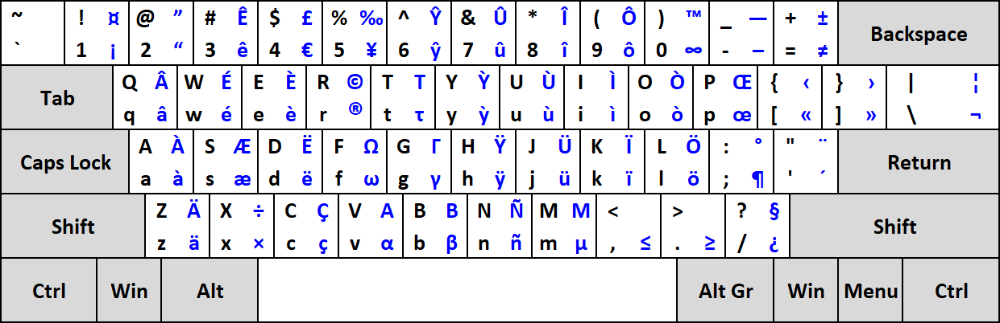
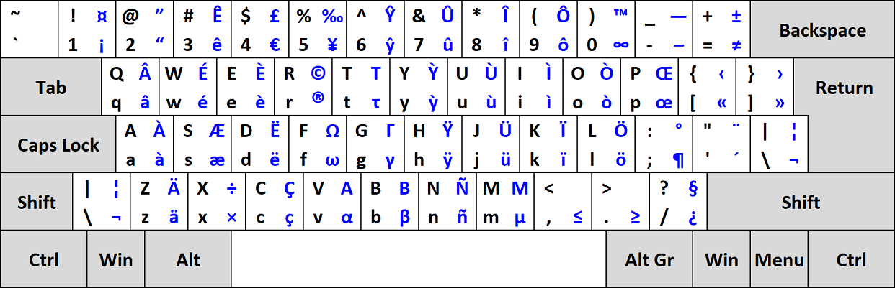
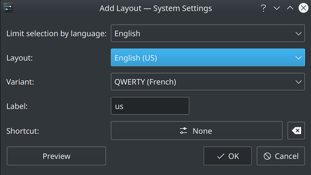

## Langue

[Français](README.fr.md) | [English](README.md)

# Description

Une disposition QWERTY conçue pour taper en français sans utiliser de touches mortes comme la disposition US-International fournie dans Windows.\
La touche Alt droit, ou AltGr, est utilisée en combinaison pour taper les caractères français.

## Aperçu rapide
Accent aigu : AltGr + W (fonctionne uniquement pour E).
Accent grave : AltGr + lettre correspondante (fonctionne pour toutes les voyelles).
Cédille : AltGr + lettre correspondante (fonctionne pour la lettre c -> ç).
Circonflexe : AltGr + touche au-dessus de la lettre correspondante (fonctionne pour toutes les voyelles).
Tréma : AltGr + touche en dessous de la lettre correspondante (fonctionne pour toutes les voyelles).
Ligature : AltGr + touche à droite de la lettre correspondante (fonctionne pour les lettres o et a -> œ et æ).

# Disposition

## Disposition ANSI


## Disposition ISO


# Installation

## Windows

Ouvrir le fichier (.klc) avec l'outil Microsoft Keyboard Layout Creator (MSKLC), distribué gratuitement par Microsoft.\
Après avoir ouvert le fichier dans MSKLC, l'option "Project -> Build DLL and Setup Package" va créer un programme d'installation qui permet d'ajouter cette disposition à Windows.

## macOS

Télécharger les fichiers de disposition ANSI ou ISO, puis placer-les dans :\
`/Library/Keyboard Layouts/` : installation pour tous les utilisateurs\
`~/Library/Keyboard Layouts/` : installation locale à l'utilisateur

## Linux

### Méthode 1 : Installation rapide (non recommandée, sauf pour Vanilla Ubuntu 20.04)

Si vous ne souhaitez pas vous compliquer la vie et simplement utiliser la disposition de clavier sous Linux, j'ai mis en ligne les fichiers `/usr/share/X11/xkb/symbols/us` et `/usr/share/xkb/rules/evdev.xml`.\
**Veuillez noter que ces deux fichiers proviennent de Vanilla Ubuntu 20.04 (plus précisément de la version Kubuntu). Étant donné que toutes les distributions Linux sont différentes, les fichiers de base peuvent être différents, je recommanderais donc plutôt la méthode 2 ci-dessous.**\
1. Télécharger les fichiers du dépôt (dossier simple_installation) et remplacer simplement les fichiers existants.\
2. Redémarrer l'ordinateur et ajouter la nouvelle variante de disposition de clavier.

\
*Exemple avec KDE*

### Méthode 2 : Installation manuelle (recommandée)

1. Télécharger le fichier qwerty-fr dans le dossier manual_installation.
2. Copier-coller le contenu à la fin de /usr/share/X11/xkb/symbols/us et enregistrer.\
3. Editer `/usr/share/X11/xkb/rules/evdev.xml` et chercher :

```xml
<layout>
  <configItem>
    <name>us</name>
        <!-- Keyboard indicator for English layouts -->
      <shortDescription>en</shortDescription>
      <description>English (US)</description>
      <languageList>
        <iso639Id>eng</iso639Id>
      </languageList>
  </configItem>
  <variantList>

  ...

  </variantList>
```

4. Ajouter le code suivant quelque part entre les balises `variantList`.
```xml
<variant>
  <configItem>
    <name>qwerty-fr</name>
    <description>QWERTY (French)</description>
  </configItem>
</variant>
```

5. Enregistrer le fichier, redémarrer l'ordinateur et ajouter la nouvelle disposition de clavier.