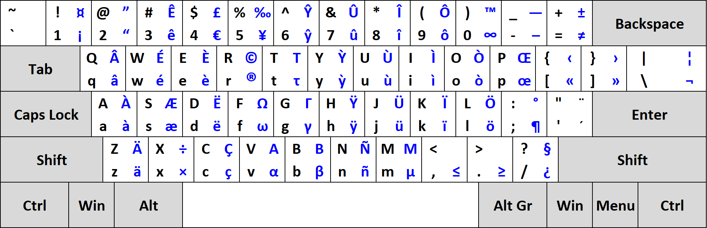

<h1>Description</h1>

A QWERTY layout designed to type French without using any dead keys like the US-International layout provided in Windows. 
Right Alt, or AltGr, is used as a combination to type french characters.

<h2>Quick overview</h2>

Acute accent: AltGr + W (only works for E). 
Grave accent: AltGr + corresponding letter (works for all vowels). 
Cedilla: AltGr + corresponding letter (works for the letter c -> ç). 
Circumflex: AltGr + key above the corresponding letter (works for all vowels). 
Diaeresis: AltGr + key below the corresponding letter (works for all vowels). 
Ligature: AltGr + key right the corresponding letter (works for letters o and a -> œ and æ).

<h1>Layout</h1>

<h1>How to build / install</h1>

<h2>Windows</h2>

Open the layout file with Microsoft Keyboard Layout Creator (MSKLC) tool, which Microsoft distributes for free. 
After opening the file in MSKLC, choosing "Project -> Build DLL and Setup Package" will create an installer that can be used to add this layout to Windows.

<h2>macOS</h2>

Download either ANSI or ISO layout files then put them in: 
/Library/Keyboard Layouts/ to install for all users 
~/Library/Keyboard Layouts/ for user-local installation

<h2>Linux</h2>

Coming soon.