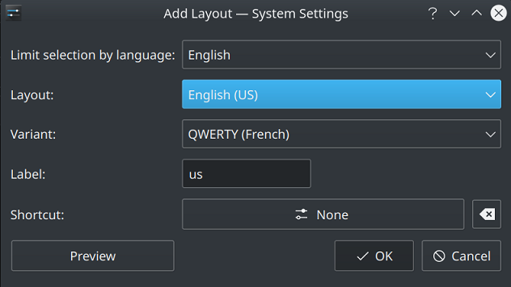

<h1>Description</h1>

A QWERTY layout designed to type French without using any dead keys like the US-International layout provided in Windows.<br>
Right Alt, or AltGr, is used as a combination to type french characters.

<h2>Quick overview</h2>

Acute accent: AltGr + W (only works for E).<br>
Grave accent: AltGr + corresponding letter (works for all vowels).<br>
Cedilla: AltGr + corresponding letter (works for the letter c -> ç).<br>
Circumflex: AltGr + key above the corresponding letter (works for all vowels).<br>
Diaeresis: AltGr + key below the corresponding letter (works for all vowels).<br>
Ligature: AltGr + key right the corresponding letter (works for letters o and a -> œ and æ).

<h1>Layout</h1>

<h2>ANSI Layout</h2>

<h2>ISO Layout</h2>


<h1>How to build / install</h1>

<h2>Windows</h2>

Open the layout file with Microsoft Keyboard Layout Creator (MSKLC) tool, which Microsoft distributes for free.<br>
After opening the file in MSKLC, choosing "Project -> Build DLL and Setup Package" will create an installer that can be used to add this layout to Windows.

<h2>macOS</h2>

Download either ANSI or ISO layout files then put them in:<br>
<code>/Library/Keyboard Layouts/</code> to install for all users<br>
<code>~/Library/Keyboard Layouts/</code> for user-local installation

<h2>Linux</h2>

<h3>Method 1: Simple installation</h3>

If you do not want to mess around and just want to use the keyboard layout under Linux, I have uploaded my <code>/usr/share/X11/xkb/symbols/us</code> and <code>/usr/share/xkb/rules/evdev.xml</code> files.<br>
Download those files in the repository (<code>simple_installation</code> folder) and simply replace them.<br>
Then, restart your computer and add the new variant layout.

<br>
<em>Example with KDE</em>

<h3>Method 2: Manual installation</h3>

Download the file <code>qwerty-fr</code> in the <code>manual_installation</code> folder.
Copy paste the content at the end of <code>/usr/share/X11/xkb/symbols/us</code> and save.<br><br>

Then, edit <code>/usr/share/xkb/rules/evdev.xml</code> and look for:

```xml
<layout>
  <configItem>
    <name>us</name>
        <!-- Keyboard indicator for English layouts -->
      <shortDescription>en</shortDescription>
      <description>English (US)</description>
      <languageList>
        <iso639Id>eng</iso639Id>
      </languageList>
  </configItem>
  <variantList>

  ...

  </variantList>
```

Add the following somewhere between the <code>variantList</code> tags.
```xml
<variant>
  <configItem>
    <name>qwerty-fr</name>
    <description>QWERTY (French)</description>
  </configItem>
</variant>
```