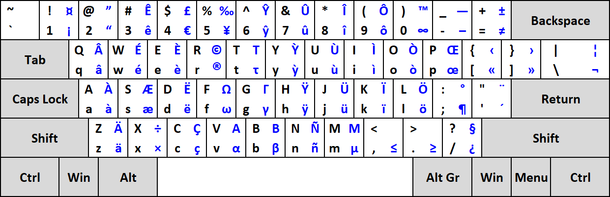

## Language

[Français](README.fr.md) | [English](README.md)

# Description

A QWERTY layout designed to type French without using any dead keys like the US-International layout provided in Windows.\
Right Alt, or AltGr, is used as a combination to type french characters.

## Quick overview
Acute accent: AltGr + W (only works for E).\
Grave accent: AltGr + corresponding letter (works for all vowels).\
Cedilla: AltGr + corresponding letter (works for the letter c -> ç).\
Circumflex: AltGr + key above the corresponding letter (works for all vowels).\
Diaeresis: AltGr + key below the corresponding letter (works for all vowels).\
Ligature: AltGr + key right the corresponding letter (works for letters o and a -> œ and æ).

# Layout

## ANSI Layout


## ISO Layout


# How to build / install

## Windows

Open the layout file (.klc) with Microsoft Keyboard Layout Creator (MSKLC) tool, which Microsoft distributes for free.\
After opening the file in MSKLC, choosing "Project -> Build DLL and Setup Package" will create an installer that can be used to add this layout to Windows.

## macOS

Download either ANSI or ISO layout files then put them in:\
`/Library/Keyboard Layouts/` to install for all users\
`~/Library/Keyboard Layouts/` for user-local installation

## Linux

### Method 1: Simple installation (not recommended, except for Vanilla Ubuntu 20.04)

If you do not want to mess around and just want to use the keyboard layout under Linux, I have uploaded my `/usr/share/X11/xkb/symbols/us` and `/usr/share/xkb/rules/evdev.xml` files.\
**Please note that those two files originate from Vanilla Ubuntu 20.04 (more precisely the Kubuntu flavour). Since all distributions of Linux are different, the base files might not be the same, so I would recommend the method 2 below instead.**\
1. Download the files in the repository (`simple_installation` folder) and simply replace them.\
2. Restart the computer and add the new variant layout.

\
*Example with KDE*

### Method 2: Manual installation (recommended)

1. Download the file `qwerty-fr` in the `manual_installation` folder.
2. Copy paste the content at the end of `/usr/share/X11/xkb/symbols/us` and save.\
3. Edit `/usr/share/X11/xkb/rules/evdev.xml` and look for:

```xml
<layout>
  <configItem>
    <name>us</name>
        <!-- Keyboard indicator for English layouts -->
      <shortDescription>en</shortDescription>
      <description>English (US)</description>
      <languageList>
        <iso639Id>eng</iso639Id>
      </languageList>
  </configItem>
  <variantList>

  ...

  </variantList>
```

4. Add the following somewhere between the `variantList` tags.
```xml
<variant>
  <configItem>
    <name>qwerty-fr</name>
    <description>QWERTY (French)</description>
  </configItem>
</variant>
```

5. Save the file, restart the computer and add the new variant layout.